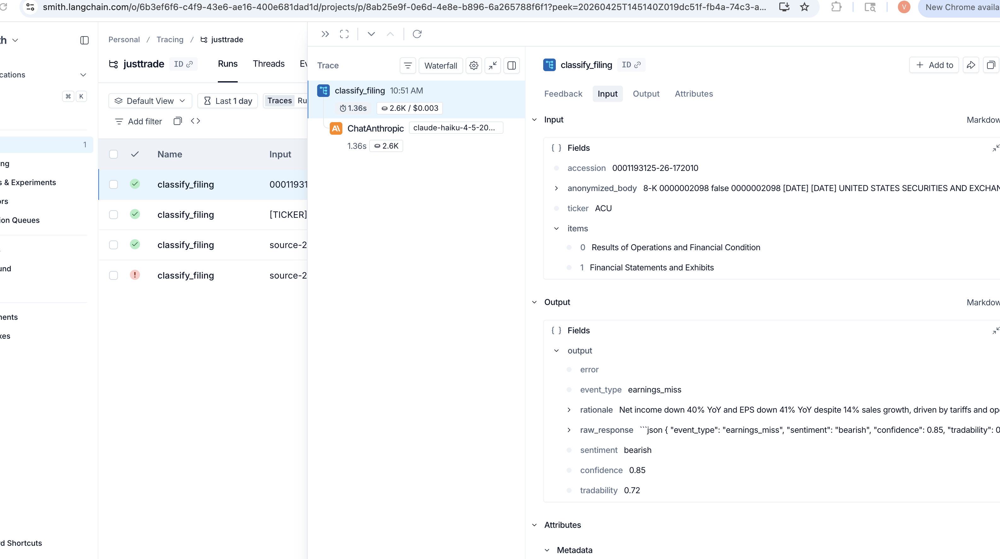

# JustTrade

> An LLM-driven event-driven trading system that ingests SEC 8-K filings in real time, classifies them with Claude, and places trades on Alpaca. Built as a 1-night prototype, then hardened into a working paper-trading system with rigorous evaluation methodology.

**Status:** Running live in paper mode via `launchd` daily at 4:15 PM ET. First trade (NGNE short) placed 2026-04-21.

## What it does

```
  SEC EDGAR              Parser              Claude Haiku              Alpaca
   (8-K feed)   →    (+ anonymizer)   →   (30+ event types)   →   (paper orders)
       ↓                                          ↓
   full-index.idx                        walk-forward backtest
```

1. **Scrapes** every 8-K filed to the SEC full-index, live
2. **Parses** the raw SGML into primary doc + EX-99 press release, keeping only what matters
3. **Anonymizes** (strips company name, ticker, dates) so the classifier LLM can't use training-data memory to cheat
4. **Classifies** events into 30+ categories (earnings, M&A, guidance, going concern, FDA, insider transactions, etc.) with sentiment and tradability scores
5. **Filters** against Alpaca shortability (most small-cap "best signals" turn out to be unshortable — critical realization)
6. **Sizes positions** against 2× ATR stop, 1% account risk, 5% notional cap per trade
7. **Places** market orders (long or short based on strategy map) on Alpaca paper
8. **Exits** after 5 business days automatically

## Stack

- **Python 3.12** (pure, no ML frameworks)
- **Anthropic Claude Haiku 4.5** — classifier with prompt caching
- **SEC EDGAR** — rate-limited full-index scraper
- **Alpaca API** — paper trading execution
- **yfinance** — historical price data for backtesting
- **launchd** — daily scheduling

## Results from 3-month out-of-sample backtest (Jan–Mar 2026)

- **9,027 real SEC filings classified** (~$15 in Claude API spend)
- **3,941 tradable signals** after confidence + tradability + price-availability filters
- **2,993 signals** after shortability filter (Alpaca won't lend you everything to short)
- Discovered 3 silent-failure biases that would have invalidated the naive strategy

## Three methodology biases caught (this is the interesting part)

### 1. Look-ahead bias from LLM training data
A naive LLM classifier "knows" what happened to stocks after their filings (training cutoff ≥ test date). Backtests look amazing, live performance collapses.

**Fix:** strip company name, ticker, and dates from filings before classification. Classify the event itself, not the issuer. Validate on filings strictly post–LLM knowledge cutoff.

### 2. Survivorship / shortability bias
First backtest showed `going_concern bearish` had mean +11.5%, Sharpe 4.75 over 5 days — a screaming sell. Phantom. When filtered to *names Alpaca will let you short*, the same bucket flipped to mean −3.4%, Sharpe −2.83. The "edge" was concentrated in unshortable micro-caps. You can't trade what you can't borrow.

**Fix:** every bucket is re-scored conditional on retail tradability.

### 3. Market-regime confound
Q1 2026 SPY was down 3.83%. That gave every bearish bet a +0.56%/5d tailwind and every bullish bet a −0.56% headwind. "Bearish wins" at the bucket level was mostly just the market being down.

**Fix:** market-adjusted returns (subtract SPY 5-day return from every trade).

## The surviving strategy

After all three adjustments, only a handful of buckets had real edge. The deployed paper strategy is:

```python
STRATEGY_MAP = {
    ("exec_appointment", "bullish"):       "short",  # sell the news
    ("buyback_announced", "bullish"):      "short",  # sell the news
    ("fda_approval", "bullish"):           "short",  # sell the news
    ("restructuring_layoffs", "bearish"):  "short",  # agree with classifier
}
```

Three of four are **contrarian** — the classifier reads these events as bullish, but historical post-filing drift in tradable (shortable) names goes the other way.

Expected edge per trade: **~1-3% market-adjusted** over 5 days. Expected frequency: **~20-40 trades/month**.

## Evaluation & Observability

Every classification call is captured as a LangSmith trace using `@traceable` + `wrap_anthropic`. Each trace records inputs (anonymized filing body, items, accession, ticker), outputs (event type, sentiment, confidence, tradability, rationale), token counts, latency, and cost.



The trace metadata (accession + ticker) makes it trivial to filter the dashboard for a single filing or company, and to spot classification drift over time. This is the foundation for the eval workflow: golden datasets → LLM-as-judge → regression tests on prompt changes.

```python
# event_bot/classifier.py — instrumented classifier
@traceable(run_type="chain", name="classify_filing")
def classify(anonymized_body, items=None, accession=None, ticker=None):
    client = _get_client()  # wrapped via wrap_anthropic — auto-traces every API call
    resp = client.messages.create(...)
    return _parse_response(resp.content)
```

## Repo layout

```
event_bot/
├── edgar.py            # SEC EDGAR scraper with rate limiting + caching
├── parser.py           # SGML → primary doc + EX-99 extraction
├── anonymize.py        # strips company/ticker/date leakage
├── classifier.py       # Claude Haiku classifier with prompt caching
├── item_filter.py      # pre-filter routine items (saves ~18% API cost)
├── pipeline.py         # batch classification with concurrency + resume
├── tickers.py          # CIK → ticker mapping from SEC
├── prices.py           # yfinance wrapper + cached returns around events
├── shortability.py     # Alpaca asset lookup + cache
├── backtest.py         # event-study returns, bucket stats, reporting
├── walk_forward.py     # rolling train/test windows (proper OOS validation)
└── paper_trader.py     # live executor with guardrails + launchd hook

classify_batch.py       # CLI: classify filings for a date range
run_backtest.py         # CLI: backtest with optional shortability filter
run_walk_forward.py     # CLI: walk-forward validation across rolling windows
fetch_filings.py        # CLI: pull filings index without classifying

com.vinit.justtrade.plist   # macOS launchd daemon (daily 4:15 PM ET)
run_daily.sh               # wrapper script invoked by launchd
```

## Getting started

```bash
# Clone + install
git clone https://github.com/<you>/JustTrade.git
cd JustTrade
python3 -m venv .venv
source .venv/bin/activate
pip install -r requirements.txt

# Configure
cp .env.example .env
# edit .env — fill in:
#   ANTHROPIC_API_KEY (from console.anthropic.com)
#   ALPACA_KEY + ALPACA_SECRET (from alpaca.markets — use PAPER keys first)
#   SEC_USER_AGENT ("Your Name your@email")

# Smoke test: classify 10 recent filings
python classify_batch.py --start 2026-04-14 --end 2026-04-18 --limit 10

# Run paper trader once (won't place live orders by default)
python -m event_bot.paper_trader

# Install daily schedule (macOS)
cp com.vinit.justtrade.plist ~/Library/LaunchAgents/
launchctl load ~/Library/LaunchAgents/com.vinit.justtrade.plist
```

## Important caveats

- **This is not financial advice.** It's a research project in paper mode.
- **The backtested edge is modest.** Even after filtering biases, expected returns are 1-3% per trade over 5 days. Nothing special after borrow + spread costs for a real retail account.
- **3 months of out-of-sample data is a tiny sample.** Edge could be noise. Needs ~12+ months of live paper trading before any real-money deployment.
- **Do not wire real money until paper-trade P/L matches backtest expectations for at least 4-8 weeks.**

## What I'd build next

- Walk-forward validation across **3+ years** (currently just Q1 2026 out-of-sample)
- **Sector + market-cap neutralization** (currently only SPY-neutralized)
- **Realistic execution model** with per-stock borrow costs and spread
- **10-Q and Form 4 (insider transaction)** signal sources, not just 8-K
- **Strategy ensemble** with risk parity weighting across multiple validated edges

## License

MIT.
